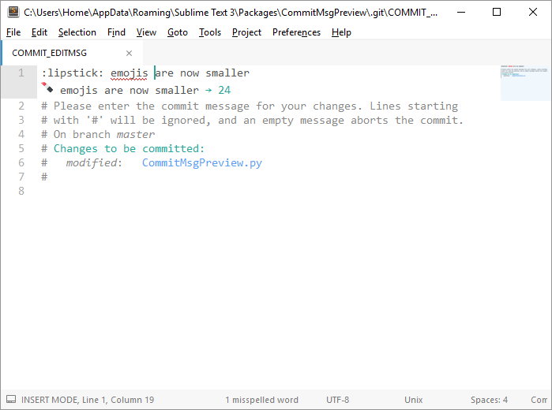

# GitMsgPreview

After discovering this [gitmoji guide][], I've become a [(huge) fan of it][1].

I also want to respect this convention:

> the first line of your commit message should be less than 50 chars

As I consider that an emoji takes up 1 char, and that we have to type the *alias* instead of the
actual character, the ruler that I set doesn't work any more.

So, this plugin just shows the actual line plus it's length under the first one *only*.



The emojis are coming from the awesome [EmojiOne][].

### You might also like

Here's other stuff you might enjoy:

#### Use Sublime Text for writing your commit messages

```bash
$ git config --global core.editor "subl -n -w"
```

*Note: if subl isn't in your, you need to replace it with the absolute path to `subl.exe`. It*
*usually located were you installed Sublime Text*

#### GitHubEmoji

Sublime Text package which provides auto completions for GitHub's Emojis (since they are pretty much
the same for everyone, it works everywhere).

- → [GitHub](https://github.com/akatopo/GithubEmoji)
- → [Package Control](https://packagecontrol.io/package/GithubEmoji)

#### Git Commit Syntax

An other Sublime Text package which provides a nice syntax highlighting for commit messages. You
definitely need this package if you want use the first trick.

- → [GitHub](https://github.com/adambullmer/sublime_git_commit_syntax)
- → [Package Control](https://packagecontrol.io/package/Git Commit Syntax)

### Gitmoji cheat sheet

I've built a little cheat sheet for this gitmoji guide using electron. Check it out!

- → [GitHub](https://github.com/math2001/gitmoji-cheat-sheet)

[gitmoji guide]: https://gitmoji.carloscuesta.me/
[1]: https://github.com/search?utf8=%E2%9C%93&q=topic%3Agitmoji+user%3Amath2001&type=Repositories&ref=searchresults
[emojione]: https://emojione.com
